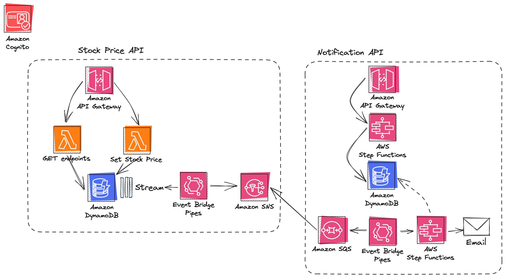

# AWS Lambda Handler Cookbook (.NET)

[](https://github.com/jeastham1993/aws-lambda-dotnet-handler-cookbook/blob/master/LICENSE)


This project provides a working, open source based, AWS Lambda handler skeleton .NET code including deployment with the AWS CDK & a GitHub Actions pipeline.

It is inspired by the [Python AWS Lambda Handler Cookbook](https://github.com/ran-isenberg/aws-lambda-handler-cookbook) developed by AWS Hero [Ran Isenberg](https://twitter.com/IsenbergRan).

## **The Problem**

Starting a Serverless service can be overwhelming. You are introducing a completely new programming model, and a vastly different way of thinking about applications as opposed to the familiar server based development experience.

There are many examples of 'hello world' Lambda functions, but few that dive into a production-ready serverless application comprised of multiple services and teams.s 

## **The Solution**

This project aims to reduce cognitive load and answer these questions for you by providing a skeleton .NET Serverless service template that implements best practices for AWS Lambda, Serverless CI/CD, and the AWS CDK in one template project.

### Serverless Service - The Stock Price service



- A stock price service that allows users to update the stock price for a given stock, and retrieve the current stock price as well as the history
- A customer service that allows users to subscribe to notifications when a given stock price changes 

<br></br>

### **Features**

- .NET Serverless service with a recommended file structure, following the hexagonal architecture pattern
- Asynchronous integration between multiple bounded contexts
- CDK infrastructure with unit, integration and functional tests.
- CI/CD pipelines based on Github actions that deploys to AWS.
- The AWS Lambda handler embodies Serverless best practices for a proper production ready handler.
- AWS Lambda handler uses [AWS Lambda Powertools](https://docs.powertools.aws.dev/lambda-dotnet/){:target="_blank" rel="noopener"} as well as the [Lambda Annotations Framework](https://github.com/aws/aws-lambda-dotnet/tree/master/Libraries/src/Amazon.Lambda.Annotations)
- Features flags and configuration based on AWS AppConfig

## Serverless Best Practices
The handler implements multiple best practice utilities.

Each utility is implemented when a new blog post is published about that utility.

The utilities cover multiple aspect of a production-ready service, including:

- [Logging](#)
- [Observability: Monitoring and Tracing](#)
- [Observability: Business KPIs Metrics](#)
- [Environment Variables](#)
- [Dynamic Configuration & feature flags](#)
- [Enabling Multiple Developers to work in the same account using postfixed stacks](#)

## Getting started
Head over to the complete project documentation pages at GitHub pages at [https://jeastham1993.github.io/aws-lambda-dotnet-handler-cookbook](https://jeastham1993.github.io/aws-lambda-dotnet-handler-cookbook/)

## Deployment

You can deploy this sample application into your own AWS account using the AWS CDK. In the future, this example will contain examples for the AWS CDK, AWS SAM, Terraform and Pulumi.

You can also include a 'postfix' as part of your deployment, enabling multiple instances of the same stack to be deployed to the same AWS account.

The project contains shared authentication infrastructure that needs to be deployed first. The StockPrice Application is also deployed independently to the feature flags, allowing features to be changed without an entire application deployment.

If this is your first time deploying, you will need to deploy the CDK projects in the below order. After the first deployment, any order is ok.

```bash
# Optionally set a postfix
# export STACK_POSTFIX="-je"
cdk deploy AuthenticationStack<POSTFIX> --require-approval=never --app "dotnet run --project cdk/src/Authentication/AuthenticationStack.csproj"
cdk deploy ConfigurationStack<POSTFIX> --require-approval=never --app "dotnet run --project cdk/src/StockPriceService/StockPriceService.csproj"
cdk deploy StockPriceStack<POSTFIX> --require-approval=never --app "dotnet run --project cdk/src/StockPriceService/StockPriceService.csproj"
```

### Commands For Auth Flow

The deployed API Gateway includes authentication using Amazon Cognito. Once deployed, you will need to run the below commands to create and configure a valid user within the Cognito user pool. Alternatively, you can run the application under `./utilities/ConfigureUserPoolUtility` to walk through the setup of a user you can use to access the API.

```
cd ./utilities/ConfigureUserPoolUtility
dotnet run
```

```
aws cognito-idp admin-create-user --user-pool-id us-east-1_a94TspUGB --username john@example.com --user-attributes Name="given_name",Value="john" Name="family_name",Value="smith"
```

```
aws cognito-idp admin-set-user-password --user-pool-id us-east-1_a94TspUGB --username john@example.com --password "<PASSWORD>" --permanent
```

```
aws cognito-idp admin-initiate-auth --cli-input-json file://auth.json
```

**auth.json**
```json
{
    "UserPoolId": "<USER_POOl_ID>",
    "ClientId": "<CLIENT_ID>",
    "AuthFlow": "ADMIN_NO_SRP_AUTH",
    "AuthParameters": {
        "USERNAME": "john@example.com",
        "PASSWORD": "<PASSWORD>"
    }
}
```
### Testing

The project contains examples of multiple types of tests:

- Unit Tests: Mock out all external integrations allowing tests to focus purely on business logic
- Integration Tests: Tests to run locally that interact with actual deployed AWS resources
- Functional Tests: Tests that run against actual AWS resources e.g. make API calls to API Gateway

The integration tests also support using the same `STACK_POSTFIX` environment variable. If you set the variable, deploy the CDK stack and then run the integration tests using the same terminal window your test execution will use the postfixed resources.

When running the functional tests locally, you also need to set the `TEMPORARY_PASSWORD` environment variable. This allows the functional tests to create a temporary user in Cognito for the tests to use.

For more information on testing, check out this [YouTube Video on testing and debugging your Lambda functions locally](https://youtu.be/962ba6mgQXI).

## Roadmap

- [] Add examples of different Lambda event sources
    - [] SQS
    - [] DynamoDB Stream
    - [] SNS
    - [] EventBridge
    - [] S3
    - [] Kinesis
- [] Add multiple micro-service example


## Code Contributions
Code contributions are welcomed. Read this [guide.](https://github.com/jeastham1993/aws-lambda-dotnet-handler-cookbook/blob/main/CONTRIBUTING.md)

## Code of Conduct
Read our code of conduct [here.](https://github.com/jeastham1993/aws-lambda-dotnet-handler-cookbook/blob/main/CODE_OF_CONDUCT.md)

## Connect
* Blog Website [James Eastham](https://jameseastham.com)
* LinkedIn: [james-eastham](https://www.linkedin.com/in/james-eastham/)
* Twitter: [@plantpowerjames](https://twitter.com/plantpowerjames)

## License
This library is licensed under the MIT License. See the [LICENSE](https://github.com/jeastham1993/aws-lambda-dotnet-handler-cookbook/blob/main/LICENSE) file.